<!-- Unified Gradient Banner (Menyatu dari atas sampai garis) -->

 

###  Stuff I Mess Around With

#### Bahasa yang Pura-pura Saya Paham

  

#### Alat Tempur Biar Bisa Rebahan

  

#### The Real Brains Carrying Me

---

###  Commit History (Mostly Trial & Error)

  

---

   <i>"Build small things, learn every day, keep it simple."</i>

